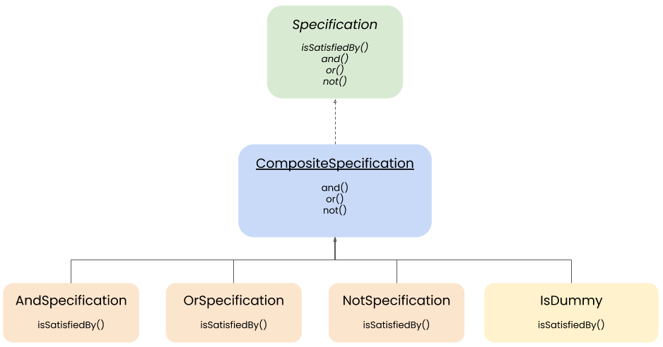
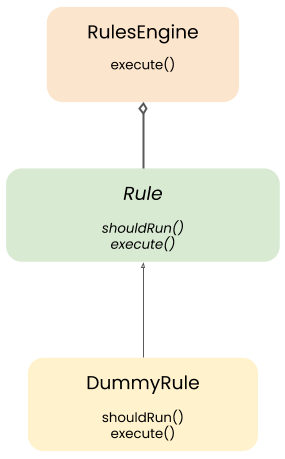
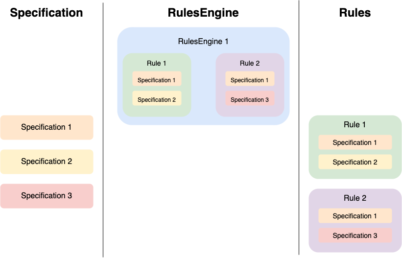

Documentation
=============

## Contents

* [Specification](#specification)
  * [Specification interface](#specification-interface)
  * [CompositeSpecification](#compositespecification)
  * [AndSpecification](#andspecification)
  * [OrSpecification](#orspecification)
  * [NotSpecification](#notspecification)
* [Rules](#rules)
  * [Rule](#rule)
  * [RulesEngine](#rulesengine)

### Specification

A specification corresponds to a precise test on a certain data. Each specification corresponds to a PHP class
having a method named **isSatisfiedBy** which takes as parameter the data you want to test and returns a boolean.

 
#### Specification interface
 
This interface declare 4 methods which constitute the heart of this pattern. 
 
 - **isSatisfiedBy** : Defines whether or not the condition is respected.
 - **and** : Defines whether or not the condition is respected by performing a logical "AND" with another condition. 
 - **or** : Defines whether or not the condition is respected by performing a logical "OR" with another condition. 
 - **not** : Defines whether or not the condition is met by reversing it.

#### CompositeSpecification

This abstract class declare the methods **and**, **or** and **not** by creating the objects
**AndSpecification**, **OrSpecification** et **NotSpecification** respectively. 

#### AndSpecification

This class performs a logical "AND" between two specifications.

#### OrSpecification

This class performs a logical "OR" between two specifications.
#### NotSpecification

This class performs a logical "NO" by reversing the condition of a specification.

[Create a specification](create-specification.md)

### Rules

A rule corresponds to an action to be applied to a data item according to its basic state. Each rule corresponds to 
to a PHP class with two methods: **shouldRun** and **execute**. A rule is composed of **one or more 
specifications** that will be used to determine whether or not the rule should be applied (using the **shouldRun**).

#### Rule

This interface declare 3 methods which constitute the heart of this pattern. 

- **execute** : Applies the business rule on the candidate.
- **shouldRun** : Determines if the business rule should be applied on the candidate.

[Create a rule](create-rule.md)

#### RulesEngine

The RulesEngine is the PHP object which is composed of several rules that it applies as needed.

[Create a rules engine](create-rules-engine.md)
